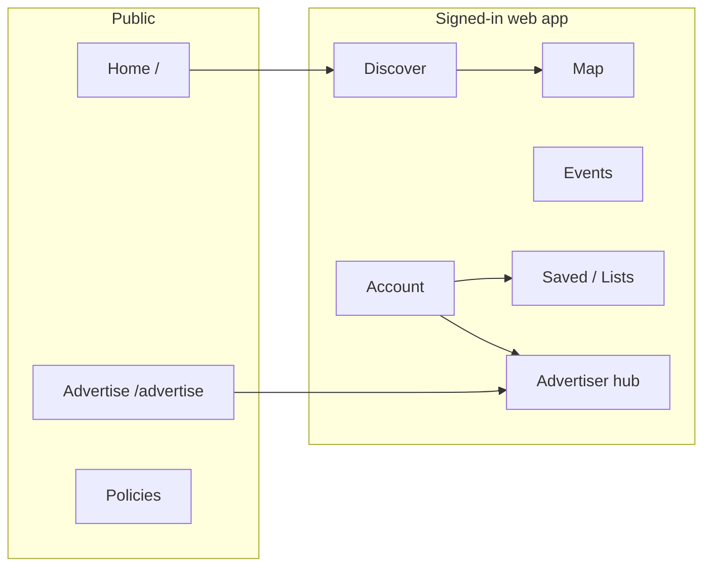

# Full UX/UI alignment spec — web ↔ app, home, permissions, dashboards

**Status:** Specification only (no implementation in this change).  
**Intent:** One coherent product experience: the **public site** and **signed-in web app** should feel like the **Android app** (Play Spotter) in **tone, color rhythm, and information hierarchy**—not like generic enterprise SaaS. This doc consolidates goals from product review **screenshots** (home, Map/Events/Discover scaffolds, account, advertiser flows, My Campaigns) and extends [landing-page-spec.md](./landing-page-spec.md), [web-ux-redesign-spec.md](./web-ux-redesign-spec.md), and [WEBSITE_SPEC.md](../../WEBSITE_SPEC.md).

---

## 1. North star

| Principle | Meaning for design & copy |
|-----------|---------------------------|
| **Family-first, place-first** | Lead with *where to go* and *what you can do there*, not with “solutions,” “platform,” or stock admin tables as the main character. |
| **App = reference** | Teal shell, card density, promotional strips, and affordances on web should **read as the same product** as the app (not a separate “marketing site + bolt-on admin”). |
| **Calm, not empty** | Reduce **bare white voids** and “dashboard table as homepage” by using **sectioning, rhythm, and purposeful negative space**—not by filling with lorem or fake data. |
| **Honest technology** | Location, maps, and “near you” use **clear, minimal** permission and privacy copy; same mental model on web and app. |

---

## 2. Evidence from screenshots (problems to fix)

These map to the review set (home, in-app home promos, Map/Events/Discover web, My Campaigns, account, advertiser hub). **Fix in priority order** after this spec is approved.

| Surface | What reads wrong | Spec direction |
|--------|-------------------|----------------|
| **Marketing home (`/`)** | Dark feature hero + line art can feel **corporate** next to warm `/advertise`; lots of **light gray / white** banding; feature grid (emoji cards) can feel like a **template**. | Move toward **warm, family-first** hero path (see §3); add **real device / app UI** where promised; tighten vertical rhythm. |
| **Consumer web (Discover, Map, Events, …)** | **Short teal title strip** + large white content = “SaaS header + empty canvas.” | **Taller, richer hero** (or illustrated band) + **grid/list density** closer to app cards; see [web-ux-redesign-spec.md](./web-ux-redesign-spec.md). |
| **Map / Events (web)** | **Coordinate table** and sparse placeholders = **dev scaffold**, not a consumer map/calendar. | Replace with **map + list** or **clear empty states**; hide or fold technical feeds behind “Advanced.” |
| **Account / profile** | **Two paths** to similar concepts (favorites vs lists) and long white forms. | **One “Saved” hub**; shorter sections; same labels as app. |
| **Advertiser: My Campaigns (app + hub)** | Lots of **white**; **two browser CTAs** felt redundant (addressed in product; spec: **one** clear web entry). | **Dark gray secondary actions** where appropriate; **one** primary “website / hub” CTA; card frames with **visible boundaries** (see live product). |
| **“How your ad looks”** | Preview **layout drift** from real ad cards. | **Parity** with `FeaturedAdCard` / `SponsoredListingCard` (split vs prime); spec detail in [web-ux-redesign-spec.md](./web-ux-redesign-spec.md). |

---

## 3. Home page (`/`) — remove “corporate” feel, match app tone

### 3.1 Visual and emotional direction

- **Align with app + `/advertise`:** Favor **warm off-white / soft sky** bands and **teal accents** over “heroic dark + stock grid.” The **landing-page-spec** v2 options apply: **light hero** with art in a **card** or **re-cut hero asset** for light background.
- **Replace template signifiers:** Reduce reliance on **emoji feature grid** as the only personality; add **iconography in brand style** or **small app UI crops** for credibility.
- **Typography:** Slightly **rounder, larger** body; avoid tight all-caps eyebrows and extreme letter-spacing; headings should feel **parent-to-parent**, not **deck title**.

### 3.2 Content and proof

- **Screenshot strip (Phase 1 debt):** Implement the **3–4 phone frames** (real app screens) promised in [WEBSITE_SPEC.md](../../WEBSITE_SPEC.md) — this is the strongest “not corporate” signal: *real product*.
- **Photo strip:** Keep real play imagery but **tighten** so it doesn’t read as “stock photo padding”; ensure **credits** stay visible and layout doesn’t dominate the fold.

### 3.3 CTAs and story arc

- **Primary:** Get the app / open web app — **one** obvious primary per viewport.
- **Secondary:** Discover, Advertise, Support — **verb-led**, same order and wording as app-adjacent web routes.
- **No dead air:** If a section doesn’t earn its height, **merge or cut**; avoid large white gaps between banded sections.

### 3.4 Acceptance (home)

- [ ] First screen reads **Play Spotter** (family, places) not **generic B2B**.
- [ ] Visual language **closer to `/advertise`** or explicit **light hero** spec (no orphan dark block without purpose).
- [ ] At least one **real in-app** visual in the first two scrolls (device frame or honest screenshot).
- [ ] **Lighthouse / a11y:** Contrast and tap targets for all hero CTAs.

---

## 4. Web app shell — match app tone and “connect” routes

### 4.1 Shared design tokens

- **Single source:** `--teal`, surface grays, **card** radii, and **header** bar treatment should match `globals.css` and app `FormColors` / Material baseline (document token table in implementation).
- **Navigation:** **One** “Saved” model (lists + favorites) per [web-ux-redesign-spec.md](./web-ux-redesign-spec.md); **Account** links use the same names as the app (“My Campaigns” vs random labels).

### 4.2 Consumer page frame (Discover, Map, Events, Lists, …)

- **Hero band:** **Taller** (min height band), optional **subtle pattern** or **illustration**; never a **single-line** strip on desktop.
- **Content:** Cards use **visible boundaries** and **consistent padding**; avoid “one table = whole page” for signed-in **consumer** views.

### 4.3 Cross-linking (“connect everything”)

- **Deep links:** From marketing home → `/discover?region=…` only when honest; from **Advertiser** hub → app store + in-app **My Campaigns** copy matches.
- **Session:** Signed-in **same account** on web and app: surface **where** the user is (region, advertiser status) in **one** account summary pattern.
- **Footer / help:** **Support, privacy, terms, delete account** same paths as [WEBSITE_SPEC.md](../../WEBSITE_SPEC.md).

### 4.4 Acceptance (shell)

- [ ] **Nav labels** match app information architecture (post–lists/favorites merge).
- [ ] **No orphan pages** (every consumer route reachable from nav or account).
- [ ] **Breadcrumbs or page title** always visible for signed-in app (not a blank white header).

---

## 5. Location and map permissions (web + alignment with app)

### 5.1 Principles

- **Purpose limitation:** Ask for **browser geolocation** only when the feature **requires** it (e.g. “Near me” on Discover/Map, distance sorting). Do not request on **first paint** of `/` without context.
- **Parity with app:** App uses OS location prompts with **in-app rationale**; web should use a **pre-prompt** pattern: short **why** + **Allow** / **Not now**, then the browser dialog.
- **Fallback:** If denied, **ZIP / city search** and **last-used region** (if stored with consent) — same priority as app’s manual region flow.

### 5.2 Spec by surface

| Surface | When to ask | If denied |
|---------|-------------|-----------|
| **Marketing `/`** | **Do not** auto-prompt geolocation. Optional “Use my area” on CTA. | N/A |
| **Discover / Map (web)** | On **first** “Near me” or “Center on me” (user gesture). | Show search + list without distance sort. |
| **Events (web)** | When user enables “Near me” for events. | City/region selector. |
| **Account** | Link to **privacy** and **how we use location**; no map permission here. | — |

### 5.3 Copy and compliance

- **Privacy policy** link adjacent to any **persistent** “use location” toggle.
- **No dark patterns:** “Not now” must not nag on every navigation; **snooze** or **dismiss for session** optional.

### 5.4 Acceptance (location)

- [ ] No **automatic** `navigator.geolocation` on load for marketing home.
- [ ] **User gesture** before browser prompt on app routes.
- [ ] **Clear empty state** when location off (search-first UX).

---

## 6. Dashboards and tools — user- and eye-friendly

### 6.1 Advertiser (web hub + in-app My Campaigns)

- **Visual density:** **Cards** with clear **outlines**; avoid **unbounded white** between modules; use **section titles** and **dividers** with purpose.
- **One web entry (product direction):** **Single** CTA to **hub / pricing** (browser) with **dark gray** secondary styling where it’s auxiliary to “Create / Edit” **teal** primaries.
- **Preview truth:** “How your ad looks” **must** mirror **live** ad layouts (prime split, inline split) — see [web-ux-redesign-spec.md](./web-ux-redesign-spec.md).
- **Analytics:** Charts and tables: **default collapsed** long tables; **summary first**; export secondary.

### 6.2 Account / signed-in home (web)

- **Scannable blocks:** Profile, **Saved**, **My campaigns** (if advertiser), **Support** — not one endless form.
- **Reassurance:** Short line on **email, region, and kids’ data** (if applicable) with link to privacy.

### 6.3 Admin (if exposed on web)

- **Scaffold vs ship:** **Coordinate feeds** and raw JSON-style tables are **not** end-user UI; either **hide** behind admin flag or **re-skin** as “tools” with clear **developer** styling—never the default **consumer** map page.

### 6.4 Acceptance (dashboards)

- [ ] **Primary task** in **one screen height** (e.g. “see campaign health” without scrolling past empty space).
- [ ] **Table views** are **progressive** (summary → detail), not the only content above the fold.
- [ ] **Advertiser** web + app use the **same** names and **same** creative preview rules.

---

## 7. Information architecture — “connect everything”

- **Single sign-in story:** After login, user lands in **Discover** or **last route** (spec choice); **Account** always shows **entry points** to Saved, Campaigns, Support.
- **Deep links:** Email campaign links → **web hub** with **token** or sign-in; **in-app** links use **custom scheme** or web fallback per [full-parity spec](./full-parity/website-full-parity-implementation-spec.md).
- **Naming:** **Play Spotter** everywhere; no mixed legacy product names in nav or email.

### Acceptance (IA)

- [ ] **No duplicate nav** items for the same job (favorites + lists).
- [ ] **Advertiser** and **parent** experiences feel like **one account**, not two products.

---

## 8. Accessibility and motion

- **Contrast:** All text on **teal** and **gray** buttons meets **WCAG AA** (esp. white on teal, white on #424242).
- **Focus:** Skip link on app layout; **visible focus rings** on web components.
- **Motion:** No auto-playing **large** parallax; hero motion **reduced** when `prefers-reduced-motion`.

---

## 9. Phased delivery (suggested)

| Phase | Scope |
|-------|--------|
| **P0** | Home hero warmth + screenshot strip *or* framed app art; nav Saved merge; **no** auto geo on `/`. |
| **P1** | Consumer `ConsumerPageFrame` hero + card density; Map/Events **empty/real** states. |
| **P2** | Advertiser hub polish + table progressive disclosure; admin scaffold separation. |
| **P3** | Full [full-parity](./full-parity/website-full-parity-implementation-spec.md) SEO and route matrix. |

---

## 10. Out of scope (this spec)

- Native **iOS** app (call out “coming soon” per marketing).
- **Rebranding** logo or new illustration **commissioning** (only **placement** and **style direction** here).
- **Backend** location storage compliance beyond **linking** to privacy and existing APIs.

---

## 11. Related documents

- [WEBSITE_SPEC.md](../../WEBSITE_SPEC.md) — phases and file map  
- [landing-page-spec.md](./landing-page-spec.md) — home history and v2 options  
- [web-ux-redesign-spec.md](./web-ux-redesign-spec.md) — nav, hero, ad preview parity  
- [full-parity/website-full-parity-implementation-spec.md](./full-parity/website-full-parity-implementation-spec.md) — route and feature matrix  

**Sign-off:** Design + product (visual direction, home hero variant), Eng (location behavior, nav routes), **Legal** if geolocation copy or banners change materially.

When P0–P1 acceptance checklists are green, update this file’s **Status** to **Partially implemented** and link the implementing PRs.
